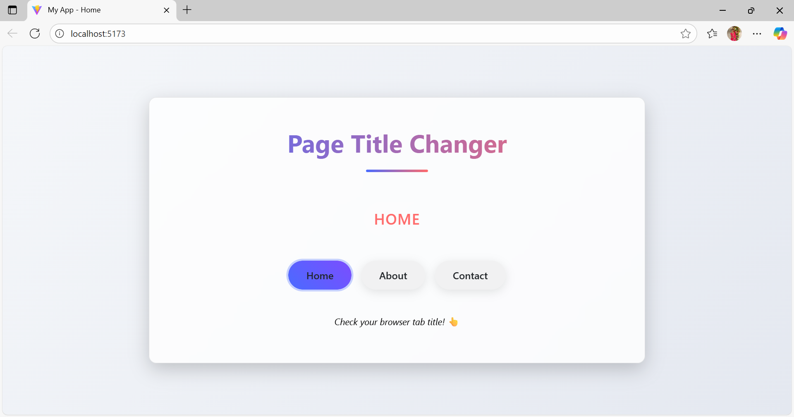

# React useEffect - Page Title Changer

This project demonstrates how to use the **useEffect** hook in React to dynamically update both the **browser tab title** and a **pagename** when switching between Home, About, and Contact.

## 🚀 Features
- Updates the **browser tab title** when a button is clicked.
- Displays a **pagename**/ (HOME / ABOUT / CONTACT) that changes based on the selection.
- Minimal and clean UI with styled buttons.
- Practice of `useState` and `useEffect` hooks together.

## 🛠️ Tech Stack
- **React (Vite)**
- **JavaScript (ES6+)**
- **CSS**

## 📸 Output Screenshots

### 🏠 Home Selected
  
Tab Title: **My App - Home**  
Displayed Text: **HOME**

---

### 📖 About Selected
  
Tab Title: **My App - About**  
Displayed Text: **ABOUT**

---

### 📩 Contact Selected
  
Tab Title: **My App - Contact**  
Displayed Text: **CONTACT**

---

## ⚡ How to Run Locally
```bash
# Clone the repository
git clone https://github.com/tgmonisha/react_UseEffect.git

# Navigate to project folder
cd react_UseEffect

# Install dependencies
npm install

# Start the dev server
npm run dev
